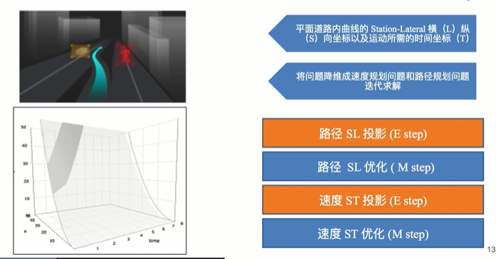

# 无人车规划问题与解决框架

## 什么是路径规划问题

 无人车规划模块是控制车辆安全平稳运行到达终点的枢纽，其计算速率，平滑性，稳定性等会直接影响无人车运行的安全和平稳

 > 平滑性和稳定性会直接影响控制的精度

 ## 无人车决策规划问题的输入和输出

输入：  

1. 障碍物信息与预测轨迹：获取障碍物点云信息，以及障碍物的轨迹
2. 本车状态：包含车辆本身的信息，方向盘转度，速度，位置，朝向等等
3. 交通灯信息：红绿灯信息
4. 高精地图：路径中心线，边界，到边界距离等等
5. 导航信息：类似地图导航

## 怎样系统性解决决策规划问题

- 明确问题和目的，什么可以做，什么不能做
    - 遵守交通规则
    - 路网内规划，和地图信息强以来，非自由空间规划

- 从简单到复杂
    - 先解决无障碍物，交通灯情况下无人车平稳的运行
    - 带障碍物停车、跟车、红绿灯下是否能完成
    - 障碍物减速绕行，十字路口等等
    - 被动换道
    - 主动换道

- 将问题拆解，分而治之
    - 场景划分，静态障碍，动态障碍；
    - 速度规划和路径规划解耦

## 无人车规划模块的设计思路 -- 多策略并发机制

- 先进行不同道路策略上的规划，比较最优选择

- 策略之间是相互独立的（本车道策略和换车道策略是不同的）

- 策略比较选择最优

## 无人车规划模块的设计思路 -- 道路内规划

- 道路信息整合在道路中心线构建的平滑坐标系上
- 能否找到满足交通规则的道路内最优解
- 满足性能上的优化

### 平滑SL坐标参考系生成与信息的整合

- 路径规划的平稳性强依赖道路中心线
- 路径规划将为1维问题

1. 平滑性 可以保证曲率2阶可导
2. 安全性 严格满足约束条件
3. 适配性 线上线下的适配
4. 时效性 满足规划问题的效率需求

## 道路内规划的“硬约束”与“软约束”

1. 硬约束
    - 交通规则 以规则形式写入代码
2. 软约束
    - 从规则变为优化策略
3. 最优路线选择
    - 基于样条的二次规划

## 规划模块架构 - 系统性的抽象驾驶问题

# 决策规划中的优化问题

## 道路内的3维规划问题与思路（EM迭代）

## 优化问题的三个关键点

- 目标函数 目标函数是各项指标的线性叠加
- 约束条件 满足交规，避免碰撞
- 优化求解 最终转化为无人车平滑行驶的轨迹

## 解决非凸函数的优化问题思路

非凸问题往往同时有局部最优和全局最优

- 撒点获取粗略解 对应规划模块的动态规划算法(DP)
- QP二次优化获取精确解 对应规划模块的二次样条(QP)

## 路径规划

