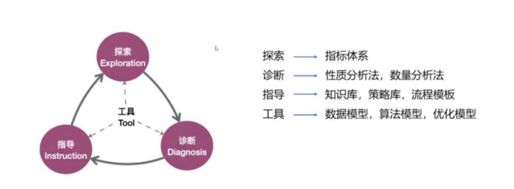

# 第一章 数据分析概念与职业操守
---
## **数据分析基本概念**

**1. 数据分析**

> 用适当的分析方法和挖掘方法对收集来的数据进行研究总结，提取有用的信息，形成结论并支持决策的过程。

> 数据分析就是利用数据来理性思考和决策的过程

> 数据分析在企业中分为宏观分析和微观分析两大类。前者站在企业经营和运营的视角，为决策层和管理层提供数据支持；后者站在客户的视角，进行客户洞察，挖掘客户需求和匹配产品和服务，落地自动触发策略。

**2. 数据挖掘**
> 是一个跨学科的计算机科学分支，它是用人工智能、机器学习、统计学和数据库的交叉方法在相对较大型的数据集中发现模式的计算过程。

**3. 大数据**

> 体量巨大、来源多样、生成极快、复杂多变，并且难以用传统数据体系结构进行有效处理。

## **数据分析目的及其意义**

> 以数据为分析对象，以探索数据内的有用信息为主要途径，以解决业务需求为最终目标。

## **数据分析方法与流程**

### **流程：**

    1.业务描述性分析流程
        1. 业务理解：理解业务问题及需求，制定分析计划
        2. 数据获取：基于业务需求，多渠道获取分析数据
        3. 数据处理：将原始数据进行清洗、加工，从而得到高质量可分析的有效数据的过程
        4. 数据分析： 对有效数据进行分析的过程
        5. 结果展现：将分析结果以分析报告或可视化分析报表等形式呈现给决策者的过程

    2.数据挖掘流程（CRISP-DM方法论）
        1. 业务理解：从商业角度理解项目目标和要求，通过分析转化为数据挖掘可操作的问题，并制定实现目标的初步计划。
        2. 数据理解：开始于原始数据的收集，然后熟悉数据、标明数据质量问题、初步探索数据、发掘有趣的子集，以形成可供挖掘的数据关系的假设。
    3. 数据准备：将原始数据集中构造出数据挖掘所需的数据，获取所需的信息。
    4. 建模：选择和应用各种适合的建模技术，同时对它们的参数进行调整，以达到最优值。
    5. 模型评估：根据项目目标来评估模型效果。
    6. 模型发布：由模型使用者根据当时背景和目标完成情况，决定如何在现场使用模型。

### **方法：（EDIT数字化模型）**

    探索（Exploration）、诊断（Diagnosis）、指导（Instruction）和工具（Tool）

**1.业务运行探索（E）**

探索关注企业各项业务的***运行状态***、各项指标是否合规以及各项业务的***具体数据***情况等等。

**2.问题根本原因诊断（D）**

当业务指标偏离正常值时，采用定性和定量相结合的方式，在中、微观层面***定位和分析问题***。

**3.业务策略指导（I）**

在确定获客群体后，我们就需要考虑下如何制定业务策略指导。根据知识库、策略库、流程模板可以便捷地制定***优化策略***。

**4.智能算法工具（T）**

算法架构是EDIT数字化模型的***发动机***。服务于价值经营、客群运营、全面质量管理、全面风险管理等各个方面。

## **数据分析的不同角色与职责**

### 从工作内容的角度划分职责

1. **纯数据相关类岗位**：针对数据本身做各种工作，对数据分析结果的输出与落地则关注不多。

2. **数据赋能类岗位**：不是单纯的数据分析岗位，而是在实际工作中需要应用数据分析的知识与技能的岗位。

### 从知识层级的角度划分职责

1. **业务数据分析师**：业务数据分析师需要具备开展数字化工作，并在工作流程中顺利应用业务描述性分析的知识与工具的能力；要能构建数字化运营指标体系，能进行业务根因分析，能为企业的数字运营提供策略支持。（业务数据分析师不只要有足够的数据分析的知识，更重要的是要有业务知识和行业经验。）

2. **建模算法分析师**：需要具备分析也无需求，根据需求产出高质量数据挖掘模型，并将模型部署应用的能力。

3. **数据科学家**：数据科学家是集技术专家与业务专家的角色于一身，可以推动人类认知水平的科学工作者；是可以带领团队，在数据科学的某个领域做出突破性贡献的专业人才；是全体CDA人努力的方向。

---

## **数据分析师职业道德操守**

    1. 将数据产权、用户利益和机构利益置于个人利益之上，保护数据资产的安全性，遵循数据的真实性、可靠性，禁止技术欺诈、数据造假、非法交易，损害用户和机构利益。
    2. 保持和加强自身职业道德操守以及同行的操守。不参与任何违法行为；不使用或滥用他人职权；不参与诽谤和侮辱；不宽恕或帮助他人参与违法行为。

## **数据分析师专业行为准则**

    1. 专业、审慎、高效地完成各项数据分析的业务流程
        
        1 保证数据的合法性、时效性、全面性。全面了解业务背景、痛点、需求，做出分析建议，与团队充分沟通，确定合理的业务指标，获取符合要求的源数据。
        
        2 保持工具的前沿性、适用性、高效性。根据业务需要，选择合理的工具、平台、系统及算法,保障数据的高效处理与建模分析。

        3 不断迭代并优化业务指标与数据模型，使研究结果更具解释性、预测性、可行性。

        4 撰写专业可视化报告，逻辑清晰展示项目成果，并提出具有商业价值的建议。

    2. 尊重契约，按时按质完整交付工作成果，并对相关数据、代码、结果保密。不得随意变更约定内容，不得拖延、敷衍工作成果，不得私下收取额外费用。

    3. 履行后期义务与责任。完整交付结果后，须对客户提供后期解答、咨询、维护等服务；须对机构业务进行后期跟进、优化、指导；善于自我总结、反思、提升。

---

**信息隐私权**： 信息隐私权的直接目的在于保护个人权利，使其隐私不因政府或商业机构使用计算机等高科技处理个人信息而受到侵害。更深层次的含义是通过信息隐私权的赋予，维护个人自主性、自我认同和个人尊严。

    隐私是一种个人权利，即我的信息不被滥用，不被他人知道的权利。

    安全是一种机制，即为了确保隐私权得到保护而设立的一种机制。

    首先明确个人权利。然后设置机制去保护权利。

## **国外隐私相关法律要求**

    存在美国和德国两大模式的分野

## **国内大数据立法的历程和展望**

保护公民个人数据信息安全已写入**刑法**
    《中华人民共和国刑法修正案（九）》

    2016年11月7日，通过《中华人民共和国网络安全法》

    2020年6月28日-30日，《中华人民共和国数据安全法》迎来初次审议。

    2021年6月10日，通过《中华人民共和国数据安全法》

## **欧盟《通用数据保护条例》GDPR中企业和个人的数据使用权限**

**核心目标**：将个人数据保护深度嵌入组织运营，真正将抽象的保护理论转化为实实在在的行为实践。

    企业在收集用户的个人信息之前，必须向用户说明：将收集用户的哪些信息、收集到的信息将如何进行存储、存储的信息会如何使用、企业的联系方式。

    用户享有的权利有：
    1. 数据访问权
    2. 被遗忘权
    3. 限制处理权
    4. 数据携带权
