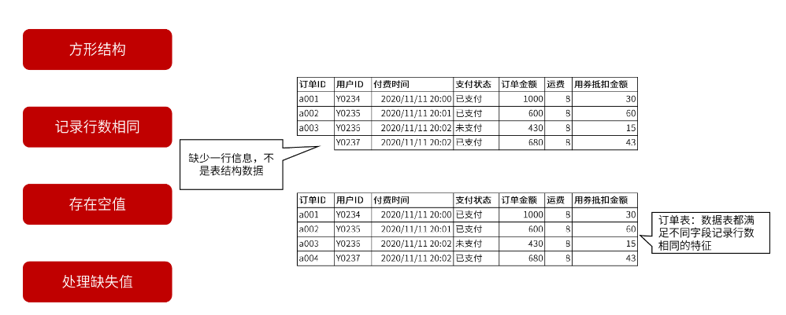

# 第二章 表格结构数据与表结构数据

[TOC]


    结构化数据指数据结构规范、完整的数据，主要产生于企业的业务系统及客户端应用程序。

> 交易记录、产品信息、库存信息等

    非结构化数据是指数据结构不规范、不完整、格式多样、难以理解、难以进行标准化处理的数据。来自企业系统之外的数据，大部分都属于非结构化数据。

> 聊天记录，网站图片、视频等


---

## 1. **表格结构数据特征**

## 表格结构数据概念

    表格结构数据是指应用在电子表格工具上的数据。表格结构数据需要用电子表格工具对其进行处理加工、分析及展现。

## 表格结构数据处理工具

    主流的有微软公司的Excel、苹果公司的Numbers及金山办公的WPS表格

## 表格结构数据特征

    1. 表格结构数据层级
    
        单元格 -> 单元格区域 -> 工作表 -> 工作簿


        父级->子级：一个父级对象下包含多个不同子级对象
    
        子级->父级：一个子级对象只能属于某一个特定的父级对象
    
    2. 表格结构数据的数据类型
        
        在表格结构数据中可以为不同的单元格设置不同的数据类型，但是一次只能为一个单元格设置一种数据类型。
    
        数值型：数值型中包含整数值和小数值的信息，主要用来进行数学计算。
    
        文本型：文本值中包含文字、符号、数字等信息，主要用来对文本内容进行描述时使用。
    
        逻辑型：逻辑值中只包含真值与假值两种信息，主要用来进行逻辑判断。
    
    3. 单元格的格式属性
    
        一个单元格不仅具有数据类型的属性，还具有单元格格式的属性。主要有数字格式和显示格式两种。

> *数据类型的属性是为了让计算机能够更加准确、高效地对数据进行识别、处理、计算而存在的*

> *单元格格式的属性就是为了让用户能够更加清晰、直观地理解数据信息而存在的*

        数字格式：决定显示形式。（数字、百分比、货币和日期）（需注意表结构数据中，日期类型不是数字格式而是数据类型）
    
        显示格式：决定显示效果。（字体（自行、颜色）、单元格填充色、图标集、显示位置）。

---

## 2. **表格数据获取、引用、查询与计算**

## 表格结构数据获取方法

    1. 企业的后台数据库系统


        后台数据库系统获取数据的流程和分析人员向数据库管理人员提需求时的要求。


    2. 企业的前端操作平台


    3. 企业外部渠道


    不论从哪种渠道获取到的数据，最终都要以电子表格工具支持的数据文件的形式使用，常见的电子表格工具支持的数据文件主要有以下两种形式：
    
    1. 文本文件
    
        存储数据信息的文本文件主要有两种，分别是.csv和.txt文件。


    2. 电子表格工具文件
    
        每种电子表格工具都有自己软件专有的默认文件。WPS表格的默认文件是.et格式文件，Excel的默认文件是.xlsx文件，而苹果Numbers的默认文件是.numbers格式文件。

## 单元格区域的特征

    1. 单元格区域需由连续的单元格构成。
    2. 单元格区域须是一个方形区域。


## 表格结构数据的引用方法

    1. 单元格值的引用方法


    2. 单元格区域值的引用方法


## 表格结构数据的查询方法

    1. 使用表格工具搜索功能进行查询（ctrl+f）


    2. 使用查询函数进行查询


    函数主要由五部分构成


### *表格数据结构的计算方法*

    1. 直接计算


    2. 函数计算


## 表格结构数据的常用函数


---

## 3. **表结构数据特征**

    表结构数据的主要来源是数据库中的数据表。一个数据表有一个表名，表名的作用是区分不同的数据表。一个数据表由多列不同“字段“及多行不同“记录”构成。


## 主键的意义

    一个好的数据库环境要按照“范式规范”进行设计，而范式规范中的第二范式要求数据表中的每行记录必须可以被唯一区分，用来区分每行记录使用的字段或字段组合就是主键。
    
    1. 物理意义


    2. 业务意义： 主键是表的业务记录单位。数据表中的所有非主键字段都要围绕主键字段展开，只有能够扩充及描述主键信息的字段才能出现在同一个表中。


**确定主键的方法**


## 维度及度量的意义

    以电商平台记录的用户购买信息为例：
    
    每一行“记录”记录的是与此次交易相关的各种信息，主要分为两类：
    1. 一类是用来描述交易行为不同角度的信息，称之为“维度”，
    2. 另一类是描述交易结果的信息，称为“度量”。
    
    表结构数据中的维度字段一般是文本型字段，而度量字段一般是数值型字段。


### 维度表

    只包含维度信息而不包含度量信息的表称为维度表，例如：产品表、客户信息表、学员信息表等字段。表中的字段不涉及任何业务行为产生的结果，只单纯统计及列举所属维度的各种不同属性内容。
    作用：用来扩展观测业务问题的角度及细节。

### 事实表

    既包含维度信息又包含度量信息，例如，订单表，采购进货单明细表、库存表等。
    作用：记录业务的实际情况，在业务描述性分析中，用事实表中的度量字段对业务行为产生结果的好坏程度进行描述。


## 缺失值

    表结构为了构成一个连续、完整的方形结构，就必须满足每个字段的记录行数相同的条件。若在表结数据中确实存在没有明确数值的记录，那么该处的记录中使用的是空值。空值在计算机中使用null表示，在数据分析工作中，将空值称为缺失值。

**处理缺失值**

    1. 当缺失值出现在文本型字段中且对分析结果影响不大是，可以选择不进行处理或这也可以用其他没有实际业务含义的文本字符对缺失值进行替换。
    
    2. 当缺失值出现在文本型字段且对分析结果产生重要影响时，一般分析人员只能通过与缺失值记录行信息录入者进行确认的方法对缺失值进行替换处理。若信息录入者也无法确定缺失值的有效信息，此行记录内容很可能是一行无效或者错误的数据记录，可将此行记录内容删除。
    
    3.当缺失值出现在数值型字段中时，需要综合考虑该数值型字段所代表的的度量意义，以及针对该数值型字段进行汇总计算的方式，来最终决定对缺失值的具体处理方法。


## 表结构数据特征

    1. 第一个特征是表结构数据中的基本引用、操作、计算单位是字段或记录行。因此在表结构数据中，一次引用、操作及计算过程都至少要对一整列或一整行数据产生影响。表结构数据中很难对某一个特定单元格值进行单独的处理与分析。

> 字段的第一行叫做字段名，同一个表中不能出现2个以上有相同字段名的字段。

 

    2. 第二个特征是在表中所有字段的记录行数相同。与单元格区域的特征类似，一个数据表中的数据也需要是连续的呈方形结构分布。
    
    3. 第三个特征是，几乎所有数据表中都存在且只存在一个主键。


## 表结构数据与表格结构数据差异

```txt
表格结构数据和表结构数据两者的数据来源并无本质差异，只是使用数据的工具平台不同，导致两者在使用方式上存在差异。

1. 将数据源导出的数据“应用”在电子表格工具上就成为以单元格为基本处理单位的表结构数据
2. 将数据源数据“引用”到表结构数据分析工具上，就变成以字段为基本处理单位的表结构数据

应用是离线的，引用是在线的。

应用表格结构数据，是将数据源的数据下载导出为相应的数据格式文件，并应用电子表格工具打开数据文件。

引用表结构数据，是用表结构数据分析工具创建与数据源数据间的连接关系。
```


---

## 4. **表结构数据获取、加工与使用**

## 4.1 表结构数据获取渠道及方法

    和表格结构数据相同，主要有三个来源，第1个是企业的后台数据库系统，第2个是企业的前端操作平台，第3个是企业外部渠道。
    获取的方法同表格结构数据相同。

### 数据库与商业智能的概念解析

    表结构数据分析工具引用数据源数据并进行使用的过程中涉及数据库、ETL、数据仓库、OLAP、商业智能几个关键概念

#### RDBMS

    数据库一般指的是关系数据库管理系统（RDBMS），标准意义上的数据库（DB）只是关系数据库管理系统的子级对象。一个RDBMS包含多个DB,DB通过自己的自己对象——数据表（Table）来保存业务系统生成的数据信息。
    
    RDBMS的主要任务是企业业务数据的存储、检索、访问与共享，需要保证数据信息的安全、一致与完整，工作性质是事务性的，RDBMS是联机事务处理系统（OLTP）的一个重要环节，承担着数据的存储与读取的任务。
    
    优缺点：善于业务数据的存储与读取，不善于对海量数据进行计算分析；能为分析任务提供绝大多数数据信息，但无法提供所有数据星系；能够共享数据，无法共享分析结果。

#### 商业智能

为了完成完整、多源的海量数据获取、加工、分析及共享任务，除了RDBMS外，还要有一套强于获取、加工多源数据、对海量数据进行多维分析并能够即时共享分析结果的计算机应用系统，由ETL功能、数据仓库功能、OLAP功能及数据可视化功能几部分构成，这种系统称为商业智能（BI）系统。其意义在用于为企业决策者快速提供完整、准确、深入的数据分析结果，帮助企业决策者实现商业洞察。

商业智能系统可以由多个不同独立工具组合构成，也可以是一个封装了所有功能的完整工具。根据服务对象范围及使用目的的不同，可以分为企业级商业智能系统及敏捷型商业智能系统两类。两种系统的对比主要如下图所示：


商业智能系统以多源表结构数据构筑的多维数据集作为分析依据，首先在数据层面解决“信息孤岛”问题，为全面提供数据分析打好基础，然后通过丰富的数据可视化表格及图标构成的仪表盘直观展现数据分析结果，在阅读层面实现数据信息的“所见即所得”。商业智能仪表盘是业务描述性分析结果的主流展现形式之一，商业智能仪表盘示例如图：


商业智能仪表盘的制作过程中，分别用到ETL功能、数据仓库功能、OLAP功能及数据可视化功能。

#### ETL

​	ETL（Extract-Transform-Load）是将分析时使用的数据从数据源经过抽取（E）、清洗转换（T）之后加载（L）到数据仓库的过程。
[4.4 ETL作用、特征](#4.4 ETL作用、特征)

#### DW（数据仓库）

​	与数据库（DB）主要用来保存业务系统生成额数据信息不同，数据仓库（DW）的主要作用是存储分析所需要的不同数据源上的所有相关数据信息。DW不仅需要引用DB中某些数据表的数据，为了保证分析内容的完整性，往往还需要引用DB之外多个不同数据源中的数据。

​	DW为业务分析任务提供完整的数据参照依据。DB能够记录及提供的数据一般要满足以下两个条件：（1）DB中记录的数据基本都来自业务系统，（2）DB中记录的数据都是结构化数据。

​	为了全面进行数据分析，单单引用DB中的数据是不够的，而引用和保存多种数据源数据的空间就是DW，但是DW要通过ETL功能中的加载功能才能对不同数据源数据进行引用。


#### OLAP（联机分析处理）

​	经过DW和ETL功能处理后的数据依然不能被直接用来分析，DW中的信息都处于孤岛状态。因此为了能够更好观测业务问题及深究问题原因，我们需要在信息孤岛间搭桥，使这些孤岛中的信息可以通过桥梁进行交互，从而有一个多维度观测业务问题的观测网，这个观测网被称为多维数据模型或多维数据集，打造观测网的软件技术被称为OLAP。


## 4.2表结构数据连接逻辑

​	业务分析过程中，为了保证信息的全面性，往往需要将不同数据表中的信息合并在一起使用。表结构数据的合并方式有横向合并与纵向合并两种。横向合并是将不同表中的字段信息合并到同一个表中使用的方式。


### 横向合并

​	横向合并的前提条件时两表间需要分别有一个可用于连接的公共字段。成为公共字段的条件时在这两个字段中的记录内容绝大多数要能够“匹配”上，即具有相同的记录值。


​	通过横向合并连接在一起的两表在进行横向合并后的合并结果最终由连接的三个属性决定，分别是方向性、主附关系及对应关系。方向性分为左表和右表两种，连接命令前的表是左表，连接命令后的表是右表。方向性决定好后，根据连接方式决定两表的主附关系。连接方式主要有三种，分别是左连接、右连接及内连接，写法分别为：“left join”，“right join”和“inner join”。左连接的主表是左表，右连接的主表是右表，内连接没有主附之分。主表公共字段中某个记录值在附表中无匹配对象时，会被匹配为空值，而附表公共字段中的记录值在主表中找不到匹配对象时，此行不会被记录，内连接没有主附之分，横向合并结果只包含两表共有的、能够相互匹配到的记录行内容。具体示例如下图：


​	横向合并的第三个属性对应关系是由公共字段中是否存在重复值决定的。公共字段中存在重复值的表成为多表，相反则称为一表。两表连接时可能产生多对多、一对多及一对一三种对应关系。对应关系决定两表连接结果的行数是两表公共字段匹配记录值乘积的结果。多表一般是将非主键字段作为公共字段使用的表，一表一般是将主键作为公共字段使用的表。实际工作中，一般应尽量选择一对多的对应关系进行连接。


##### ER图	

​	为了能够直观、清晰、全面地了解各表间的连接关系，在实际使用工具进行连接之前，需要先准备一份多表连接的“鸟瞰图”，又称E-R图（Entity Relationship Diagram，实体关系图）。当前等级要求画法是，将每个表的字段列表展现出来，再用连接线连接两表的公共字段，最后标识出两表的对应关系。


### 纵向合并

​	将多表中记录信息合并到同一个表中使用的合并方式称为纵向合并方式。主要有两种合并方式，一种是去重合并，另一种是全合并。去重合并是将记录内容完全相同的记录行去重后再进行合并的方式，而全合并是不去除重复内容的记录行，直接将不同表中所有的记录行合并在一起的方式。纵向合并需要满足两个条件，第一个条件是合并在一起的数据表应具有相同的字段数，第二个条件是相同位置上的字段数据类型应保持一致。


## 4.3 表结构数据汇总逻辑

​	对零散的表结构数据按照业务需求进行汇总分析的方法是使用表结构数据进行业务描述性分析时所使用的主要分析方法，这种分析方法成为数据透视分析方法。在电子表格工具下可以使用数据透视图、表功能进行数据透视分析，在表结构数据分析工具下可以通过编写代码或者进行对话框操作等方式进行数据透视分析。除数据库需要编写SQL命令才能得到透视结果外，不管是电子表格工具还是表结构分析工具，大多数情况下都需要通过拖曳字段的方式生成数据透视图、表。拖曳字段生成数据透视图，分为四步：1. 创建数据透视图、表模板；2. 选择维度字段拖入适当位置；3.选择度量字段拖入适当位置；4.决定维度对度量进行汇总计算时使用的计算规则。 通过数据透视图、表得到的任何结果都是在维度、度量和汇总计算规则这三个要素下共同作用生成的。


​	在透视分析中使用的维度字段又称为分组依据，汇总计算规则又称为聚合规则。维度对度量进行汇总计算的过程称为筛选。可将维度汇总度量的过程表述为：维度筛选度量，或者度量被维度筛选。

​	业务描述性分析中有5种常用的汇总计算规则，如下图所示：


## 4.4 ETL作用、特征

​	ETL的作用是将所有分析所需的分散在企业内外部的零乱、标准不统一、没有质量保证的数据整合到一起，为分析决策提供完整、高质量的数据信息。
​	E表示抽取功能，目的是将分析所需的所有相关数据从不同数据源中抽取出来为加载到数据仓库做准备。
​	T表示清洗转换功能，目的是保证数据的完整性和准确性。数据清洗的任务是过滤筛选不完整、错误及重复的数据记录（不完整数据指的是分析中需要用到而数据源中又有所缺失的数据记录，错误值可能来自不健全的业务系统、系统bug或人为输入信息错误，重复数据主要指在不应出现重复值的字段中出现重复值的情况）。数据转换主要对“粒度”不一致及“规则”不一致的数据进行转换（粒度指的是观测业务的精细程度，数据表中的最小观测粒度一般就是这个数据表中主键所代表的业务记录单位）。
​	L的作用是将处理后的数据加载到数据仓库中进行存储和使用。DB用来保存业务系统生成的数据信息，而DW是存储分析所需要的不同数据源上的所有相关数据信息。

ETL常见的执行顺序分为两类，一类是按照ETL顺序执行，另一类时按照ELT顺序执行。加载对象数据仓库的处理能力越强，处理数据量越大，清洗转换逻辑越复杂，越倾向于ELT顺序。


## 4.5 应用E-R图

[ER图](#ER图)

## 4.6 计算两表连接汇总值


