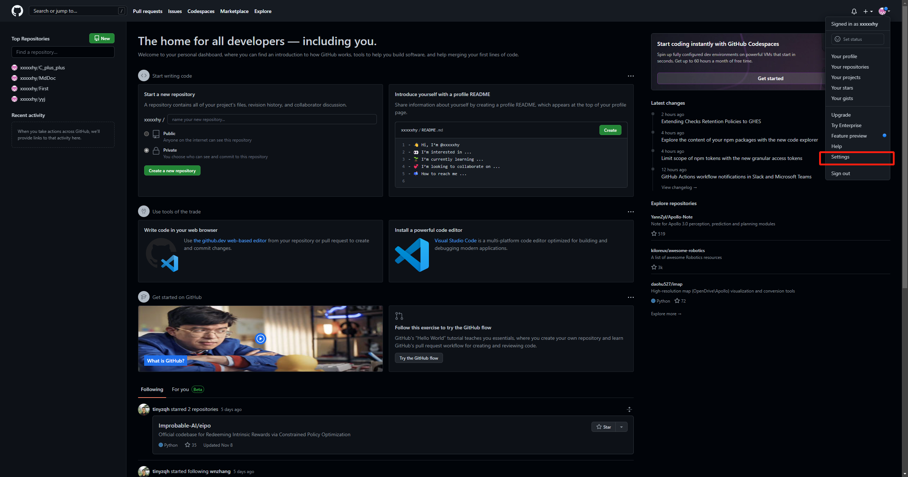
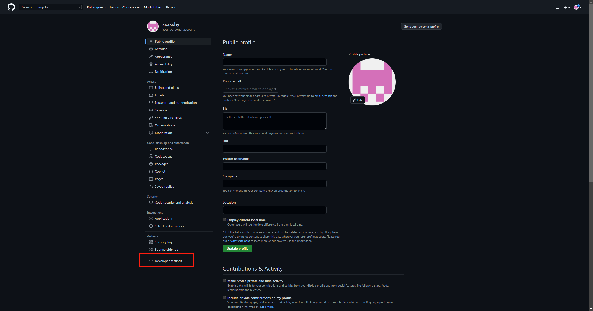
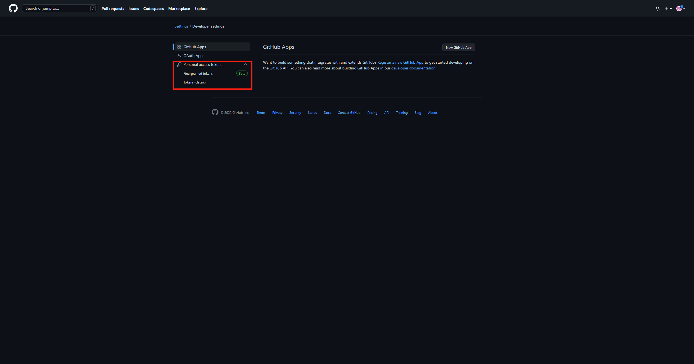
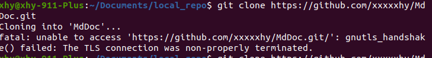
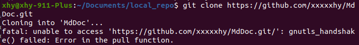
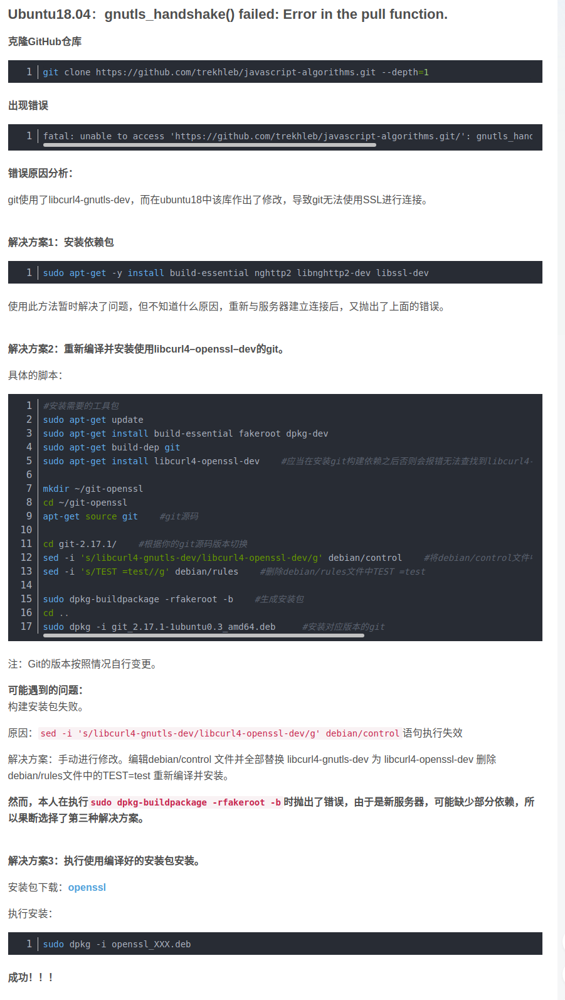

# **Linux**

## **github token 验证**

> 在使用git进行远程仓库操作时比如（clone,push,pull等），github使用新的验证方式，即token

- ### **1. token创建**

    > 这部分主要参考github官网教程以及一些网上给的教程，以以下图片的方式进行保存

     github主页 -> 点击头像 -> settings -> developer settings -> personal access tokens -> Fine-grained tokens / tokens 任选其一进行创建tokens

    

    

    

        > 关于两种不同的token创建方式，fine-grained 能够创建的token更加细致，有更多的权限设置，tokens创建方式则较为简单直接。  

        > 关于权限的设置，个人的选择是通过tokens创建方式并全选权限

- ### **2. token使用**
     执行git操作时会提示输入用户名和密码，用户名便是你的github用户名，密码则是创建的token
    > 需注意，创建的token只有一次保存机会，注意将token保存好
- ### **3. token缓存**

     为避免每次进行远程操作时都要重复输入token，使用git打开缓存
    ```sh
    #默认缓存15分钟
    git config --global credential.helper cache
    #可以更改默认的密码缓存时限
    git config --global credential.helper 'cache --timeout=3600'
    #取消缓存设置
    git config --global --unset credential.helper
    ```

## **git错误记录**

### **1.gnutls_handshake**
#### a. TLS connection

**解决方式**: 由于网络连接失败导致，确定网络状况良好即可解决
#### b. error in pull function


**解决方式**：



# **Windows**

```sh
git init # 创建当前文件夹为git仓库
git add # 
git commit -m ""
git remote add origin 远程库地址
git push -u origin master
git push origin master
```