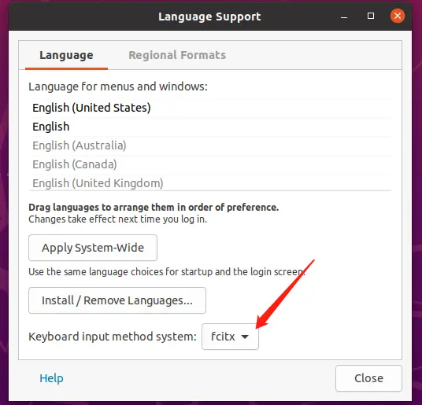
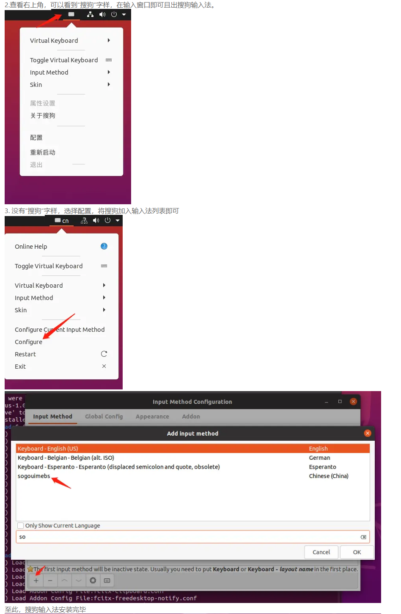

# input setting

``` sh
sudo apt install fcitx # 安装

# 设置fcitx为系统输入法，如下图1

sudo apt purge ibus # 卸载系统输入法ibus

sudo dpkg -i sogouxxxxxxxxx.deb # 安装搜狗拼音deb包

# 安装输入法的依赖
sudo apt install libqt5qml5 libqt5quick5 libqt5quickwidgets5 qml-module-qtquick2

sudo apt install libgsettings-qt1

# 重启系统，选择输入法，如下图2
```



